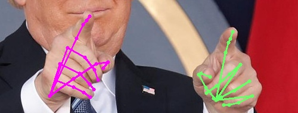
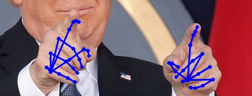
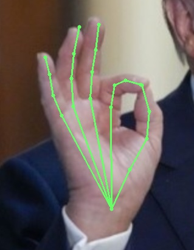
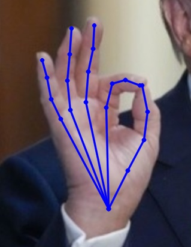
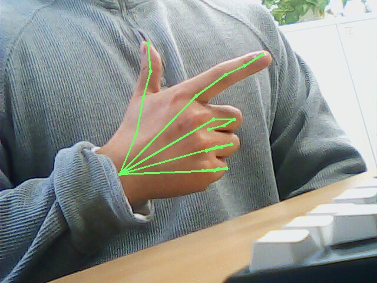
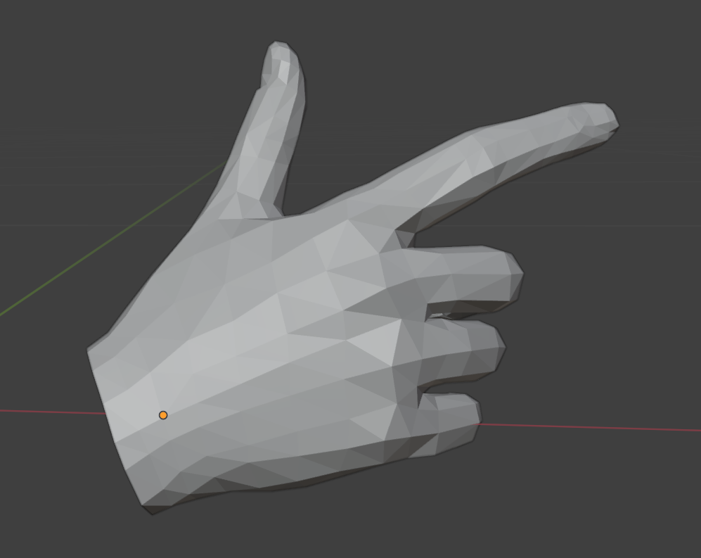
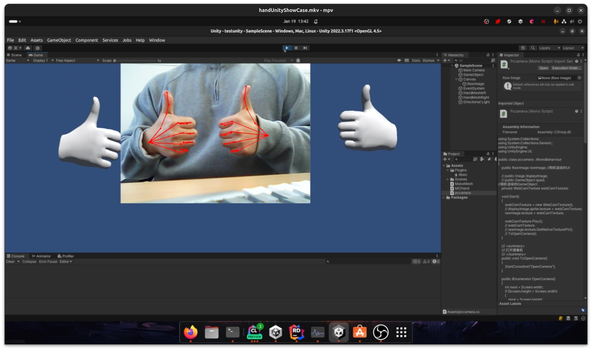
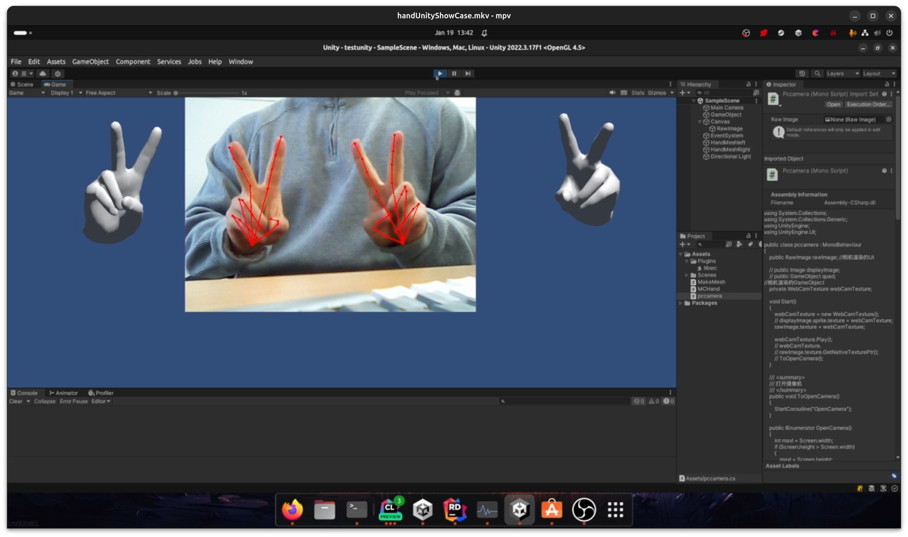

# Real-time recognition of hand gestures

A real-time hand gesture recognition

Inference acceleration by Nvidia Tensorrt , the inference time dropped from 880ms to 7ms

# 🔨Setup

### pre-requirement

- [NVIDIA TensorRT SDK](https://developer.nvidia.com/tensorrt) for inference
- [MouseChannel Plugin for NVIDIA TensorRT SDK ](https://github.com/MouseChannel/TensorRT) to use custom operator in
  tensorrt
- [InterWild](https://arxiv.org/abs/2303.13652) Published at CVPR 2023 by Facebook  (recognition of hand gestures 2023
  SOTA)

has tested in Ubuntu23.10,by Tensorrt 8.6.1

# Workflow

Pytorch Model ➡️ ONNX ➡️ Tensorrt

using **three custom operators**

- 🌟**MouseChannelInverse**🌟 : Matrix Inverse by Cuda
- 🌟**MouseChannelSelect**🌟 : Handling dynamic tensor size which is not allowed in native static compute graph
- 🌟**MouseChannelSmallAngle**🌟: Integrated some operations in pytorch and implemented them in cuda

In Pytorch Model Three custom operations are registered. In Tensorrt Use plugins to implement these custom operators

# 🎏Performance🎏

|                         | native pytorch                                 | Tensorrt using float32                       | 
|-------------------------|------------------------------------------------|----------------------------------------------|
| time of inference       | 884.3ms                                        | 9.31ms    (**9498**%🚀)                      | 
| accuracy error(case1)   | 0%   | 1.1%   | 
| accuracy error  (case2) | 0%         | 0.3%     | 

# 🌞Overview🌞

Real-time hand recognition,is able to generate **Hand Joints Image** and generate **Hand Mesh**

### 🫱 showcase

     

 
 
real-time Hand Joints
 

### 🫱 Unity Plugin

have test in **Unity 22.3LTS, Ubuntu23.10**

- real-time hand-joint-inference
- real-time animated hand-mesh

    

 
real-time Hand Joints
 

### 🫱 Unreal Plugin
#### 🔞(in Develop)