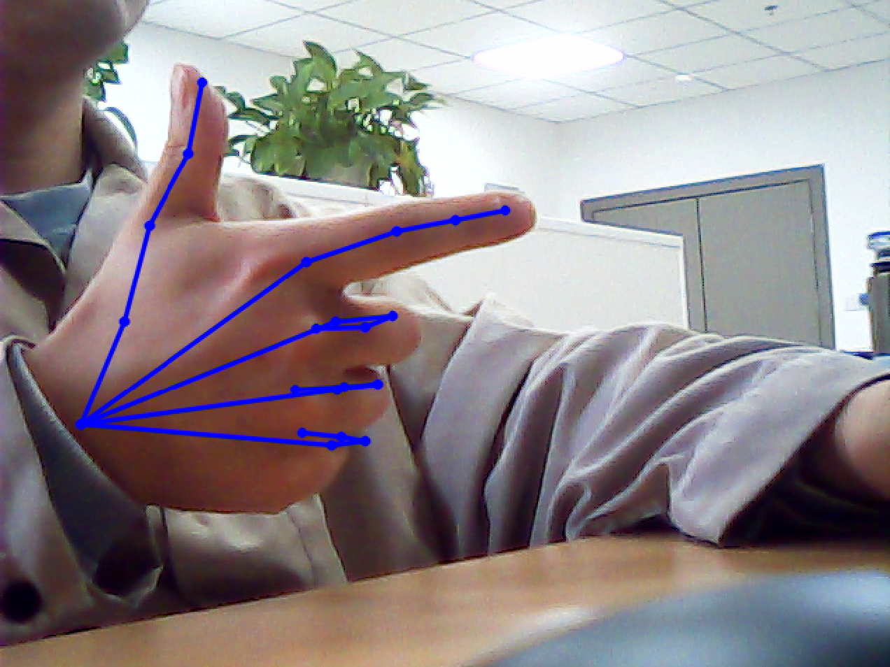

# Real-time recognition of hand gestures
A real-time hand gesture recognition

Inference acceleration by Nvidia Tensorrt , the inference time dropped from 880ms to 7ms
# 🔨Setup
### pre-requirement
- [NVIDIA TensorRT SDK](https://developer.nvidia.com/tensorrt) 
- [MouseChannel Plugin for NVIDIA TensorRT SDK ](https://github.com/MouseChannel/TensorRT) to use custom operator in tensorrt
- [InterWild](https://arxiv.org/abs/2303.13652) Published at CVPR 2023 by Facebook  (recognition of hand gestures 2023 SOTA)

has tested in Ubuntu23.10,by Tensorrt 8.6.1

# 🌞Overview🌞
### 🫱  showcase

     
 

//todo